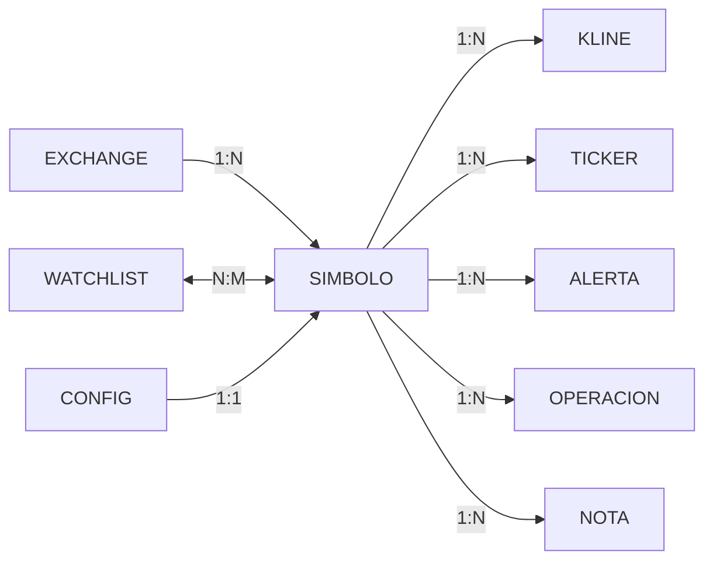

# Datos de cada coleccion

Este documento describe cada coleccion de la app: donde se guarda, cual es su clave y que campo tiene, con su tipo, si es obligatorio y que valores admite. Es el esquema de la base documental, junto con el diagrama y las relaciones.

## Diagrama

Aclaraciones:

- `EXCHANGE` y `SIMBOLO` son arrays dentro de `catalogo.json`
- `WATCHLIST.items` es un array de objetos dentro de la watchlist

### exchange

| Clave | Campo | Tipo | Condicion | Descripcion |
| ----- | ----- | ---- | --------- | ----------- |
| primaria | `id` | string | obligatorio | por ejemplo `binance` |
|  | `nombre` | string | obligatorio | nombre para mostrar |
|  | `baseUrl` | string | obligatorio | raiz de la API REST |
|  | `wsUrl` | string | obligatorio | raiz del WebSocket publico |
|  | `pesoPorConsulta` | number | obligatorio | peso que consume una consulta de velas |
|  | `limitePorMinuto` | number | obligatorio | limite de peso por minuto segun el exchange |

### simbolo

| Clave | Campo | Tipo | Condicion | Descripcion |
| ----- | ----- | ---- | --------- | ----------- |
| primaria | `symbol` | string | obligatorio | en mayusculas y sin separador, como `BTCUSDT` |
|  | `base` | string | obligatorio | moneda base, como `BTC` |
|  | `quote` | string | obligatorio | moneda de cotizacion, como `USDT` |
| foranea | `exchange` | string | obligatorio | referencia a `exchange.id` |
|  | `intervalos` | array de string | obligatorio | intervalos disponibles para ese simbolo |

### kline

Una vela OHLCV (precio de apertura, precio mas alto, precio mas bajo, precio de cierre, valor final) de un simbolo en un intervalo.

| Clave | Campo | Tipo | Condicion | Descripcion |
| ----- | ----- | ---- | --------- | ----------- |
| primaria | `_id` | string | obligatorio | `<symbol>-<interval>-<openTime>` |
|  | `type` | string | obligatorio | siempre `kline` |
| foranea | `exchange` | string | obligatorio | referencia a `exchange.id` |
| foranea | `symbol` | string | obligatorio | referencia a `simbolo.symbol` |
|  | `interval` | string | obligatorio | `1m`, `5m`, `1h`, `4h`, `1d` |
|  | `openTime` | number | obligatorio | epoch en ms UTC |
|  | `open` | string | obligatorio | precio de apertura |
|  | `high` | string | obligatorio | precio maximo |
|  | `low` | string | obligatorio | precio minimo |
|  | `close` | string | obligatorio | precio de cierre |
|  | `volume` | string | obligatorio | volumen en la moneda base |
|  | `closeTime` | number | obligatorio | epoch en ms UTC |
|  | `quoteVolume` | string | obligatorio | volumen en la moneda de cotizacion |
|  | `trades` | number | opcional | cantidad de operaciones del periodo |
|  | `ingestedAt` | number | obligatorio | epoch en ms UTC, momento de la captura |

### ticker

Precio de la operacion con las estadisticas de 24 horas. Se puede descartar.

| Clave | Campo | Tipo | Condicion | Descripcion |
| ----- | ----- | ---- | --------- | ----------- |
| primaria | `_id` | string | obligatorio | `<symbol>-<timestamp>` |
|  | `type` | string | obligatorio | siempre `ticker` |
| foranea | `exchange` | string | obligatorio | referencia a `exchange.id` |
| foranea | `symbol` | string | obligatorio | referencia a `simbolo.symbol` |
|  | `price` | string | obligatorio | ultimo precio negociado |
|  | `timestamp` | number | obligatorio | epoch en ms UTC |
|  | `open24h` | string | opcional | precio de hace 24 horas |
|  | `high24h` | string | opcional | maximo de 24 horas |
|  | `low24h` | string | opcional | minimo de 24 horas |
|  | `volume24h` | string | opcional | volumen en la moneda base |
|  | `quoteVolume24h` | string | opcional | volumen en la moneda de cotizacion |

### watchlist

Los simbolos que el usuario eligio seguir.

| Clave | Campo | Tipo | Condicion | Descripcion |
| ----- | ----- | ---- | --------- | ----------- |
| primaria | `_id` | string | obligatorio |  |
|  | `nombre` | string | obligatorio | nombre de la lista |
|  | `items` | array de objeto | obligatorio | puede estar vacio |
|  | `createdAt` | number | obligatorio | epoch en ms UTC |
|  | `updatedAt` | number | obligatorio | epoch en ms UTC |

### items

| Clave | Campo | Tipo | Condicion | Descripcion |
| ----- | ----- | ---- | --------- | ----------- |
| foranea | `symbol` | string | obligatorio | referencia a `simbolo.symbol` |
|  | `addedAt` | number | obligatorio | epoch en ms UTC |
|  | `note` | string | opcional | nota del operador |

### alerta

Condicion que se chequea sobre los datos que llegan, avisando si se cumple.

| Clave | Campo | Tipo | Condicion | Descripcion |
| ----- | ----- | ---- | --------- | ----------- |
| primaria | `_id` | string | obligatorio |  |
| foranea | `symbol` | string | obligatorio | referencia a `simbolo.symbol` |
|  | `condicion` | objeto | obligatorio | que se evalua |
|  | `activa` | boolean | obligatorio | si el operador la dejo encendida |
|  | `disparada` | boolean | obligatorio | si ya se cumplio alguna vez |
|  | `ultimoDisparo` | number | opcional | epoch en ms UTC de la ultima vez |
|  | `disparos` | number | obligatorio | cuantas veces se cumplio |
|  | `note` | string | opcional | nota del operador |
|  | `createdAt` | number | obligatorio | epoch en ms UTC |
|  | `updatedAt` | number | obligatorio | epoch en ms UTC |

### condicion

| Clave | Campo | Tipo | Condicion | Descripcion |
| ----- | ----- | ---- | --------- | ----------- |
|  | `tipo` | string | obligatorio | `precio`, `variacion`, `volumen` o `indicador` |
|  | `campo` | string | obligatorio | `price`, `change24h`, `rsi14`, `ema20` |
|  | `operador` | string | obligatorio | `>`, `>=`, `<`, `<=`, `==`, `cruza_arriba`, `cruza_abajo` |
|  | `valor` | number | obligatorio | umbral |
|  | `timeframe` | string | obligatorio | intervalo sobre el que se mide |

### operacion

Compra o venta del usuario, permite derivar las metricas.

| Clave | Campo | Tipo | Condicion | Descripcion |
| ----- | ----- | ---- | --------- | ----------- |
| primaria | `_id` | string | obligatorio |  |
| foranea | `symbol` | string | obligatorio | referencia a `simbolo.symbol` |
|  | `lado` | string | obligatorio | `compra` o `venta` |
|  | `tipo` | string | obligatorio | `mercado` o `limite` |
|  | `cantidad` | string | obligatorio | como texto para no perder precision |
|  | `precioEntrada` | string | obligatorio | precio de entrada |
|  | `precioSalida` | string | opcional | null mientras esta abierta |
|  | `fees` | string | obligatorio | comisiones en la moneda de cotizacion |
|  | `abiertaEn` | number | obligatorio | epoch en ms UTC |
|  | `cerradaEn` | number | opcional | epoch en ms UTC |
|  | `estado` | string | obligatorio | `abierta`, `cerrada` o `cancelada` |
|  | `notas` | string | opcional | notas del operador |
|  | `tags` | array de string | opcional | etiquetas para filtrar |

### nota

Notas libres que pueden filtrarse y etiquetarse.

| Clave | Campo | Tipo | Condicion | Descripcion |
| ----- | ----- | ---- | --------- | ----------- |
| primaria | `_id` | string | obligatorio |  |
| foranea | `symbol` | string | opcional | referencia a `simbolo.symbol`, null si es general |
|  | `titulo` | string | obligatorio | titulo corto |
|  | `cuerpo` | string | obligatorio | texto de la nota |
|  | `tags` | array de string | opcional | etiquetas |
|  | `createdAt` | number | obligatorio | epoch en ms UTC |
|  | `updatedAt` | number | obligatorio | epoch en ms UTC |

### config

La configuracion de la terminal, segun lo que el usuario modifico.

| Clave | Campo | Tipo | Condicion | Descripcion |
| ----- | ----- | ---- | --------- | ----------- |
| primaria | `_id` | string | obligatorio | siempre `local` |
|  | `intervaloPorDefecto` | string | obligatorio | intervalo con el que abre la app |
| foranea | `simboloPorDefecto` | string | obligatorio | referencia a `simbolo.symbol` |
|  | `fuente` | string | obligatorio | `local` o `remoto` |
|  | `fuenteUrl` | string | opcional | direccion del historial remoto, null si es local |
|  | `sondeoMs` | number | obligatorio | cada cuanto se consulta al exchange |
|  | `actualizadoEn` | number | obligatorio | epoch en ms UTC de la ultima edicion |