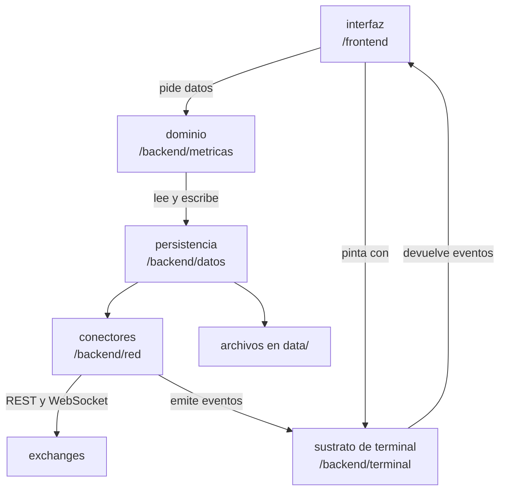

# Arquitectura del proyecto

Este documento describe la arquitectura del sistema, organizada en capas. El modelo de datos esta en [`/database`](../database), el detalle de cada modulo en [modulos.md](modulos.md) y las tecnologias con sus decisiones, en el [README](../README.md).

## Capas

Elegimos una arquitectura por capas: cada capa habla con la de abajo, nunca con la de arriba.

- La **interfaz** recibe lo que el usuario hace y muestra el estado, sin gestionar input ni render
- El **dominio** calcula indicadores y metricas de operaciones, sin saber que existe una terminal
- La **persistencia** lee y escribe los archivos, sin saber que es una operacion ni una vela
- Los **conectores** hablan con los exchanges, sin saber nada del resto de la app
- El **sustrato de terminal** maneja la pantalla y el teclado, sin saber nada de trading

Mantener esa regla central es lo que habilitara la extensibilidad, ya que permitira que un indicador se sume al dominio sin tocar la interfaz, un widget se sume a la interfaz sin tocar el dominio, o un exchange nuevo se sume a los conectores.